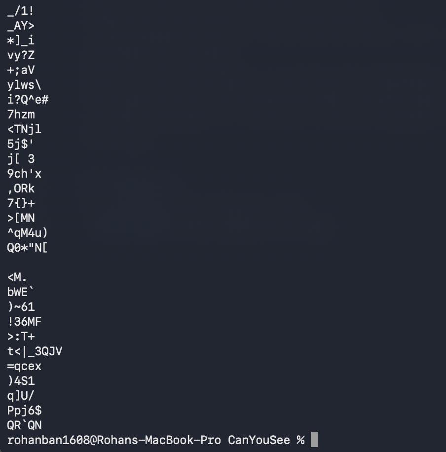
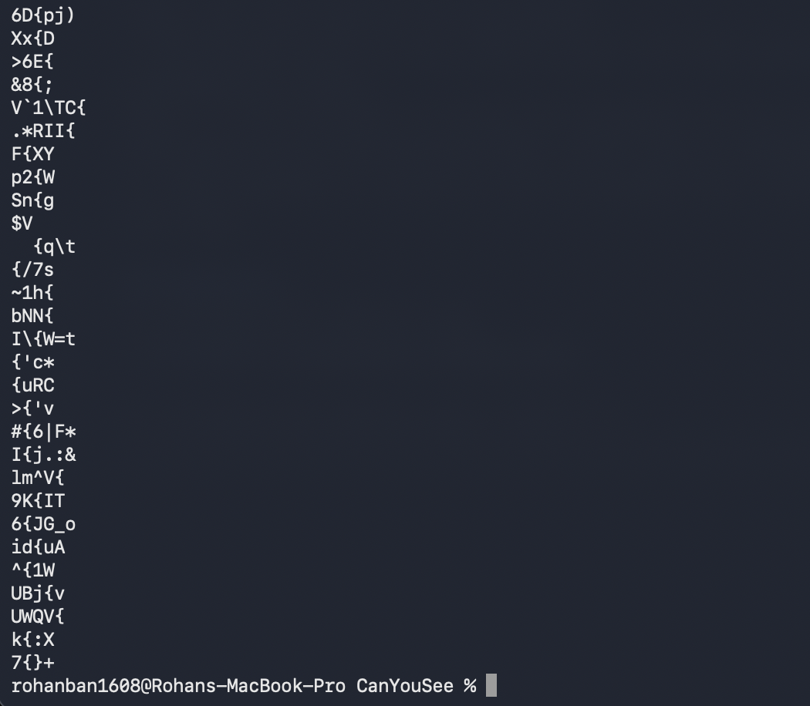
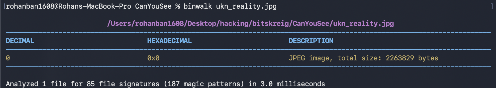
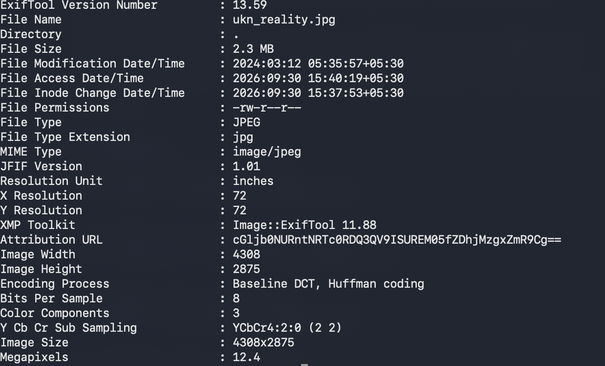

## Challenge Name: CanYouSee

## Approach:
I unzipped the file, and there was a an image ukn_reality.jpg file in the zip folder.
I ran the usual commands on the image: strings ukn_reality.jpg, but strings gave me a very long list of characters.
So, I ran strings ukn_reality.jpg | grep "{" to search for the flag, but that was of no use either
I ran binwak next on ukn_reality.jpg, but that gave me no information either.
Then, I ran exiftool to check the metadata of the image, and that gave me an attribution URL, which was of base64 format. I, then decoded it using an online base64 tool, and it gave me the flag. 

## Solution:
a: strings ukn_reality.jpg

b: strings ukn_reality.jpg | grep "{"

c: binwalk ukn_reality.jpg

d: exiftool ukn_reality.jpg
  

e: We can see attribution url is a base64 string, and after using online encoding tools, I can see the flag.

## Flag: picoCTF{ME74D47A_HIDD3N_d8c381fd}

## Takeaway: 
How to identify base64 strings, how to use exiftool to check metadata