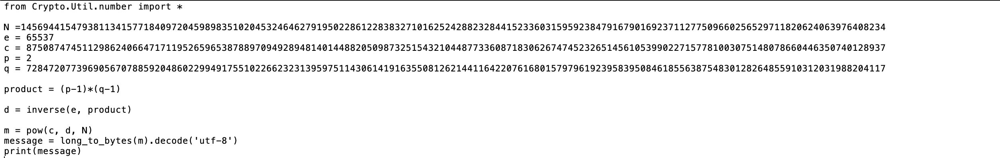

## Challenge Name = Even RSA Can Be Broken??

## Approach
So, I had to look up on cryptography about RSA, N, and e, and what all that means, and how it works using both gemini and google. After figuring it out, I tried factoring N into p and q using factordb.com. I got p = some big number and q = 2, no matter how many instances I ran. Once I got p and q, I had to calculate d, and then m using inverse functions, which I had to again use AI for. Then, I saw the source code, and realized it was converting the encoded message via utf (bytes) into a number(long), and then applying RSA on it. So, I applied the reverse functions, long_to_byte, and .decode('utf-8). After that, I got the flag.

## Solution

a: Running the instance
[N, e](screenshots/image2.png)

b: My code:

from Crypto.Util.number import *

N =14569441547938113415771840972045989835102045324646279195022861228383271016252428823284415233603159592384791679016923711277509660256529711820624063976408234
e = 65537
c = 8750874745112986240664717119526596538788970949289481401448820509873251543210448773360871830626747452326514561053990227157781003075148078660446350740128937
p = 2
q = 7284720773969056707885920486022994917551022662323139597511430614191635508126214411642207616801579796192395839508461855638754830128264855910312031988204117

product = (p-1)*(q-1)

d = inverse(e, product)

m = pow(c, d, N)
message = long_to_bytes(m).decode('utf-8')
print(message)

c: Output:

[output](screenshots/image3.png)

## Flag: academy{tw0_1$_pr!m39067edcb}

## Takeaway:
Learnt about cryptography, and RSA, how to use python functions.

