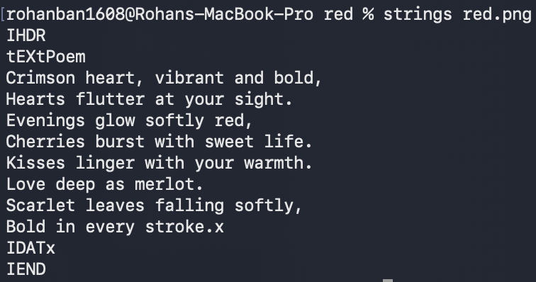
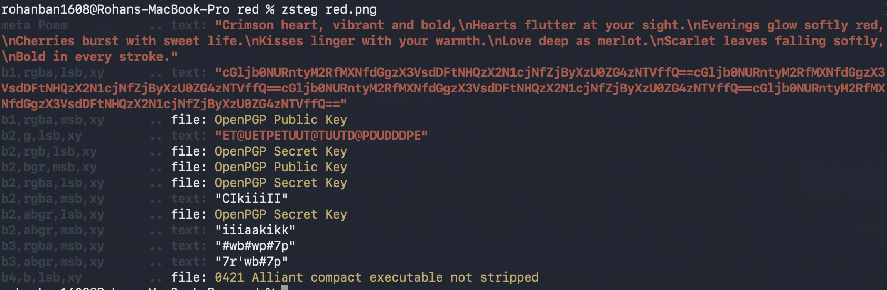

# Challenge name = red

## Approach: 
So, I first started with file red.png, which gave me a .png file
Then, I ran strings red.png, which gave me a poem, but i didn't know what to do with the poem.
I ran binwalk and checked the metadata of the file red.png
Then, I realized the capital letters of the poem, told something about check lsb.
So, I asked gemini about lsb, and what to do with it. It told me to run zsteg. So I installed zsteg using ruby, installed ruby, and ran zsteg on red.png
It gave me a base64 encoded string, which I can now recognize, thanks to the "==" at the end. Then, I decoded the base64 using an online tool, which gave me the flag.

## Solution:
Code:
a: strings red.png:

b: first letter of each line = ICHECKLSBII

c: installing zsteg via ruby and gem

d: running zsteg to check LSB

e: I got the base64 string, which I then decoded using an online tool

## Takeaway: What LSB is, and how to run zsteg next time to check files.

