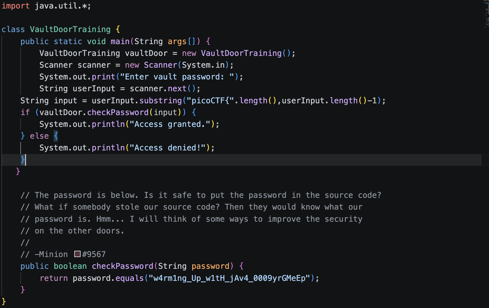

## Challenge Name: vault-door-training

## Approach
I downloaded the file, and inspected the vault-door-training.java file. After opening the file using VS Code, I could see the code of the file. I could see that the flag was hidden in the front, and I just have to add picoCTF{} to the password. After that, the challenge was solved

## Solution
a: vault-door-training.java:

## Flag: picoCTF{w4rm1ng_Up_w1tH_jAv4_0009yrGMeEp}

## Takeaway:
How to open java files and how to run java files.